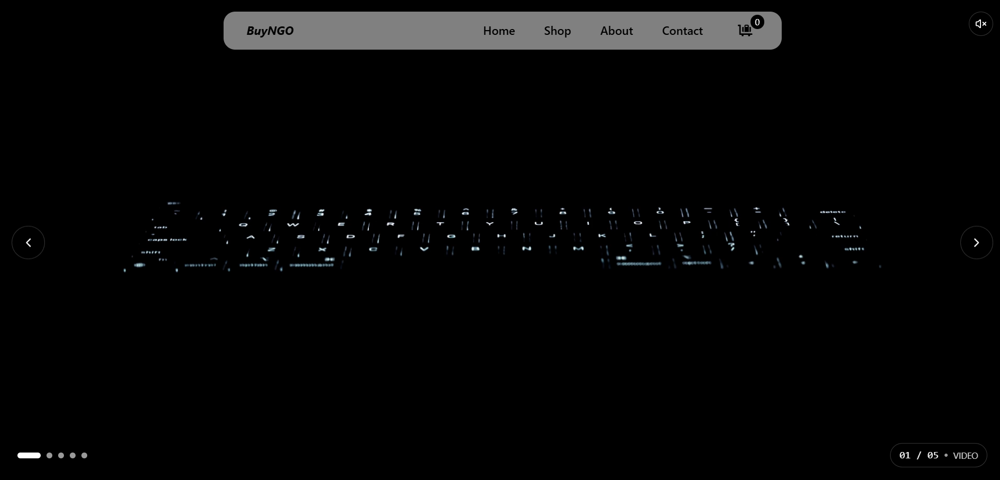
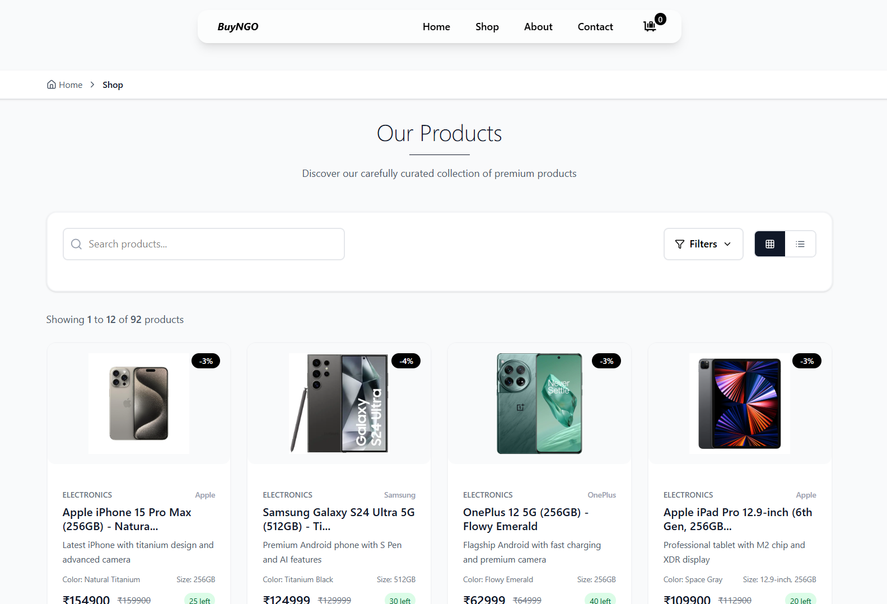
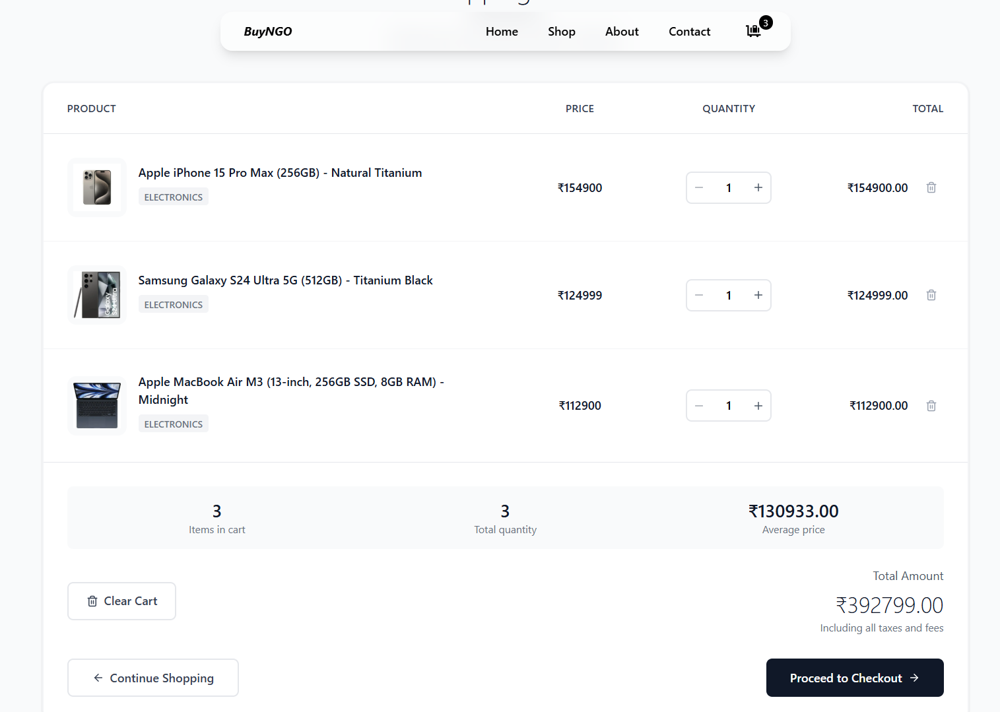

# BuyNGo 🛒

### Modern E-commerce Platform Built with React & Tailwind CSS


[🌐 Live Demo](https://buyngo.vercel.app) · [✨ Features](#features) · [🚀 Installation](#installation) · [📖 Usage](#usage)

---

## 📸 Screenshots

### 🏠 Home Page


### 🛍️ Product Catalog


### 🛒 Shopping Cart & Checkout


---

## ✨ Features

**🔍 Smart Search** | **🛒 Shopping Cart** | **💳 Secure Checkout**

**📱 Responsive Design** | **⚡ Fast Performance** | **🎨 Modern UI**

<div style="margin: 30px 0;">

### Core Functionality
- **Product Management**: Browse and search through extensive product catalog
- **Shopping Cart**: Add, remove, and manage items with real-time updates
- **Secure Checkout**: Streamlined checkout process with form validation
- **Product Search**: Advanced search functionality with filters
<!-- - **Customer Enquiry**: Contact forms and customer support integration -->
- **Responsive Design**: Optimized for desktop, tablet, and mobile devices

### Technical Features
- **React 18+**: Built with latest React features and hooks
- **Tailwind CSS**: Utility-first CSS framework for rapid styling
- **JavaScript ES6+**: Modern JavaScript with async/await patterns
- **API Integration**: RESTful API for product data and operations
<!-- - **State Management**: Efficient state handling for cart and user data
- **Performance Optimized**: Lazy loading and code splitting implemented -->

### API
- **Live API**: https://68850ebb745306380a3a371f.mockapi.io/ByuNGO

</div>

---

## 🚀 Quick Start

### Prerequisites
Make sure you have Node.js (v14+) and npm installed on your machine.

### Installation

```bash
# Clone the repository
git clone https://github.com/hardikmacbook/BuyNGo.git

# Navigate to project directory
cd BuyNGo

# Install dependencies
npm install 

# Start development server
npm run dev
```

---

## 🛠️ Tech Stack

| Frontend | Styling | Language | Deployment | ProductData |
|----------|---------|----------|------------| ------------|
| React 18+ | Tailwind CSS | JavaScript ES6+ | Vercel | API
| React Router | CSS3 | HTML5 | GitHub Actions |

---

## 📂 Project Structure

```
BuyNGO/
├── node_modules/
├── public/
│   └── assets/
│       └── images/
├── components/
│   ├── About/
│   │   └── Story.jsx
│   ├── TimeLine.jsx
│   ├── Contact/
│   │   └── ContactLayout.jsx
│   ├── Footer/
│   │   └── Footer.jsx
│   ├── Header/
│   │   ├── Logo.jsx
│   │   └── Navbar.jsx
│   ├── Home/
│   │   ├── Review/
│   │   ├── Slider/
│   │   └── StoreValue/
│   ├── test/
│   ├── lib/
│   └── Shop/
│       ├── ProductDetail.jsx
│       └── ShopLayout.jsx
├── ui/
│   ├── ScrollToTop.jsx
│   └── StPageTitle.jsx
├── context/
│   └── CartContext.jsx
├── pages/
│   ├── About.jsx
│   ├── Cart.jsx
│   ├── Checkout.jsx
│   ├── Contact.jsx
│   ├── Error.jsx
│   ├── Home.jsx
│   └── Shop.jsx
├── App.jsx
├── index.css
├── main.jsx
├── .env
├── .gitattributes
├── .gitignore
├── eslint.config.js
├── index.html
├── package-lock.json
├── package.json
├── README.md
└── vite.config.js
```

---

## 🌐 Live Demo

**Experience BuyNGo in action!**

🔗 **[Visit Live Site](https://buyngo.vercel.app)**

*Deployed on Vercel with automatic deployments from main branch*

---

## 📄 License

This project is licensed under the **MIT License** - see the [LICENSE](LICENSE) file for details.

---

## 👨‍💻 Author

**Hardik**

[](https://github.com/hardikmacbook)

---

**⭐ Star this repository if you found it helpful!**

*Built with ❤️ using React and Tailwind CSS*
